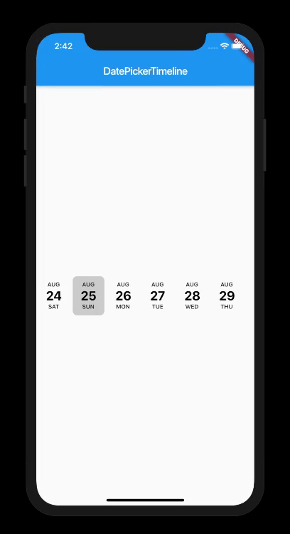
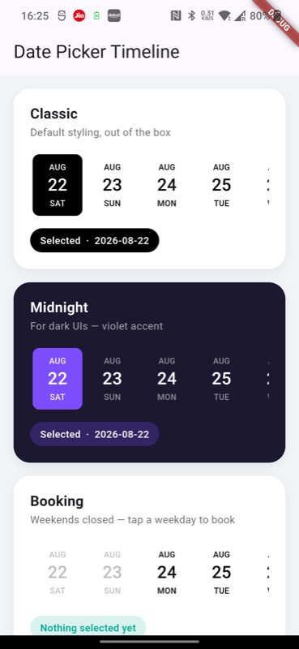
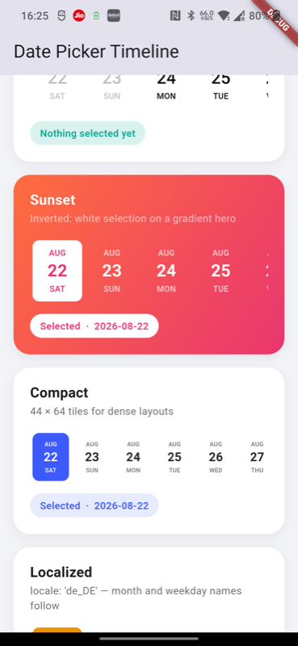
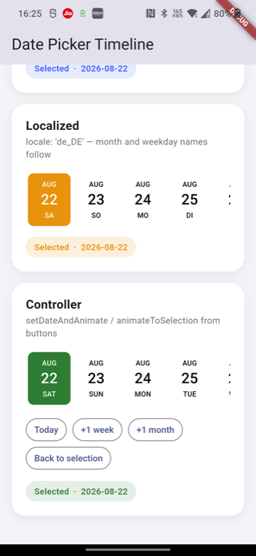

# DatePickerTimeline

[](https://pub.dev/packages/date_picker_timeline)

Flutter Date Picker Library that provides a calendar as a horizontal timeline.

<p>
 
</p>

## Installation

Add the dependency to your `pubspec.yaml`:

```yaml
dependencies:
  date_picker_timeline: ^1.3.0
```

Then import it in your Dart file:

```dart
import 'package:date_picker_timeline/date_picker_timeline.dart';
```

## Quick start

Drop a `DatePicker` anywhere in your widget tree. The only required argument
is the start date — the timeline renders from there onwards:

```dart
DatePicker(
  DateTime.now(),
  initialSelectedDate: DateTime.now(),
  selectionColor: Colors.black,
  selectedTextColor: Colors.white,
  onDateChange: (date) {
    setState(() => _selectedDate = date);
  },
)
```

## Parameters

| Parameter | Type | Default | Description |
|---|---|---|---|
| `startDate` | `DateTime` | required (positional) | First date on the timeline. Dates continue for `daysCount` days |
| `width` | `double` | `60` | Width of a single date tile |
| `height` | `double` | `80` | Height of the picker. Labels scale down automatically if the text styles don't fit |
| `controller` | `DatePickerController?` | `null` | Drives the picker programmatically — see [DatePickerController](#datepickercontroller) |
| `initialSelectedDate` | `DateTime?` | `null` | Date highlighted when the picker first builds |
| `selectionColor` | `Color` | `Color(0x30000000)` | Background color of the selected tile |
| `selectedTextColor` | `Color` | `Colors.white` | Text color inside the selected tile |
| `deactivatedColor` | `Color` | `Color(0xFF666666)` | Text color for deactivated dates |
| `monthTextStyle` | `TextStyle` | 11px, w500, black | Style for the month label |
| `dateTextStyle` | `TextStyle` | 24px, w500, black | Style for the day-of-month number |
| `dayTextStyle` | `TextStyle` | 11px, w500, black | Style for the weekday label |
| `inactiveDates` | `List<DateTime>?` | `null` | These dates are greyed out and can't be selected (e.g. weekends, holidays) |
| `activeDates` | `List<DateTime>?` | `null` | Only these dates can be selected; everything else is deactivated. Can't be combined with `inactiveDates` |
| `daysCount` | `int` | `500` | How many days to render, counted from `startDate` |
| `onDateChange` | `void Function(DateTime)?` | `null` | Called with the tapped date whenever the selection changes |
| `locale` | `String` | `"en_US"` | Locale for month and weekday names (e.g. `"de_DE"`, `"fr_FR"`) |
| `calendarType` | `CalendarType` | `gregorianDate` | `gregorianDate` or `persianDate` (Jalali) |
| `directionality` | `TextDirection?` | `null` | Overrides scroll direction; defaults to RTL for the Persian calendar, LTR otherwise |

Time-of-day components are ignored everywhere — dates are compared by
calendar day, so passing `DateTime.now()` is always safe.

## DatePickerController

Attach a controller to move the timeline from code:

```dart
final _controller = DatePickerController();

DatePicker(
  DateTime.now(),
  controller: _controller,
  ...
)

// Somewhere in your code:
_controller.animateToSelection();                 // scroll back to the selected date
_controller.jumpToSelection();                    // same, without animation
_controller.animateToDate(someDate);              // scroll to a date (selection unchanged)
_controller.setDateAndAnimate(someDate);          // select a date AND scroll to it
```

| Member | Description |
|---|---|
| `jumpToSelection()` | Jumps instantly to the selected date |
| `animateToSelection({duration, curve})` | Animates to the selected date |
| `animateToDate(date, {duration, curve})` | Animates to `date` without changing the selection |
| `setDateAndAnimate(date, {duration, curve})` | Selects `date`, repaints the highlight, and animates to it |
| `isAttached` | Whether the controller is attached to a mounted `DatePicker` |

All methods are safe no-ops when the controller isn't attached, nothing is
selected yet, or the target date is outside `startDate .. startDate + daysCount - 1`.

## Design showcase

The [example app](example/lib/main.dart) contains seven ready-made designs you
can copy into your project — Classic, Midnight (dark theme), Booking (weekends
disabled), Sunset (gradient hero), Compact, Localized, and a controller
playground:

<p>
 
 
 
</p>

Run it with:

```bash
cd example && flutter run
```

### Recipes

**Disable weekends** (Booking design):

```dart
final weekends = [
  for (var i = 0; i < 60; i++)
    if (DateUtils.addDaysToDate(DateTime.now(), i).weekday >= DateTime.saturday)
      DateUtils.addDaysToDate(DateTime.now(), i),
];

DatePicker(
  DateTime.now(),
  inactiveDates: weekends,
  daysCount: 60,
  ...
)
```

**Dark theme** (Midnight design) — provide explicit text styles, since the
defaults are black:

```dart
DatePicker(
  DateTime.now(),
  selectionColor: const Color(0xFF7C4DFF),
  selectedTextColor: Colors.white,
  deactivatedColor: Colors.white24,
  monthTextStyle: const TextStyle(color: Colors.white54, fontSize: 11),
  dayTextStyle: const TextStyle(color: Colors.white54, fontSize: 11),
  dateTextStyle: const TextStyle(color: Colors.white, fontSize: 24),
  ...
)
```

**Compact strip** for app bars and bottom sheets:

```dart
DatePicker(
  DateTime.now(),
  width: 44,
  height: 64,
  monthTextStyle: const TextStyle(fontSize: 9),
  dayTextStyle: const TextStyle(fontSize: 9),
  dateTextStyle: const TextStyle(fontSize: 16),
  ...
)
```

Author
------

* [Vivek Kaushik](https://github.com/iamvivekkaushik/)


Contributors
------------
* [BradInTheUSA](https://github.com/bradintheusa)
* [Roger](https://github.com/rogermedeirosdasilva)
